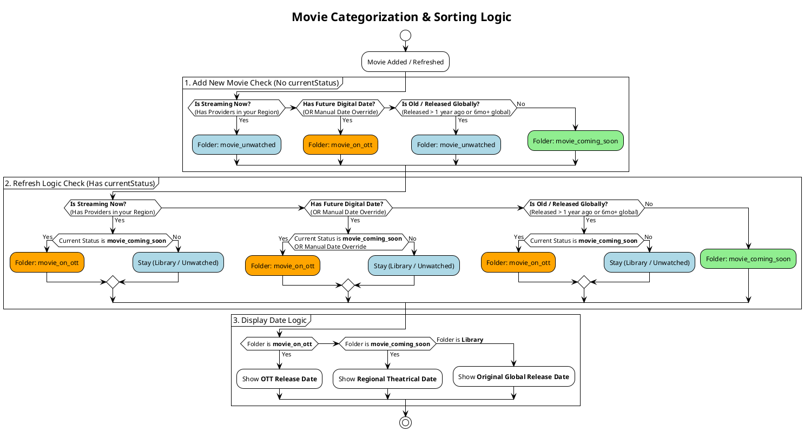

# Movie Categorization & Sorting Logic

This document defines the Source of Truth for how movies are categorized into folders (`movie_unwatched`, `movie_on_ott`, `movie_coming_soon`) and how they behave during background refreshes.

## PlantUML Diagram

## Key Rules
1.  **Add New Movie**: Priority is always given to the **Library** for available movies. Only "Future Digital" or "Coming Soon" movies go to the Upcoming feed.
2.  **Refresh Logic ("Gatekeeper Rule")**:
    *   Items only upgrade to **'On OTT'** if they were previously in **'Coming Soon'**.
    *   Items already in the **Library** (`movie_unwatched`) stay there, ensuring your watchlist remains stable.
3.  **Display Dates**:
    *   **On OTT**: Shows the Digital/Streaming release date.
    *   **Coming Soon**: Shows the Theatrical release date (Regional).
    *   **Library**: Shows the Original Global Release Date (Year).
