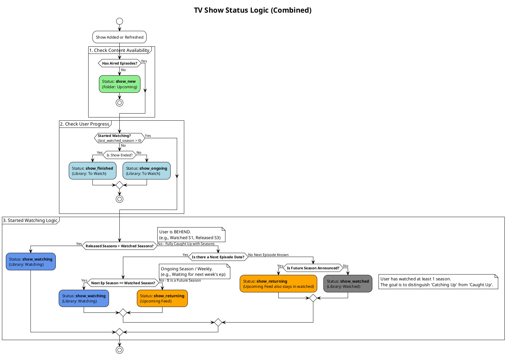

# TV Show Status Logic

This document defines the Source of Truth for how TV Shows are categorized into statuses (`show_new`, `show_ongoing`, `show_watching`, `show_returning`, `show_finished`) based on aired episodes and user progress.

## PlantUML Diagram

## Key Status Definitions
1.  **`show_new`**: No episodes released yet. (Appears in **Upcoming**).
2.  **`show_ongoing` / `show_finished`**: Episodes exist, but you haven't started watching. (Appears in **Library: To Watch**).
3.  **`show_watching`**:
    *   **Catching Up**: You are behind (Released Seasons > Watched Seasons).
    *   **Weekly Watching**: You are caught up, but waiting for the next episode in the *current* season.
4.  **`show_returning`**: You are caught up, and waiting for the **next season** (Season Premiere). (Appears in **Upcoming** AND **Library: Watched**).
5.  **`show_watched`**: You are caught up, and no future content is known (or show is ended). (Appears in **Library: Watched**).
